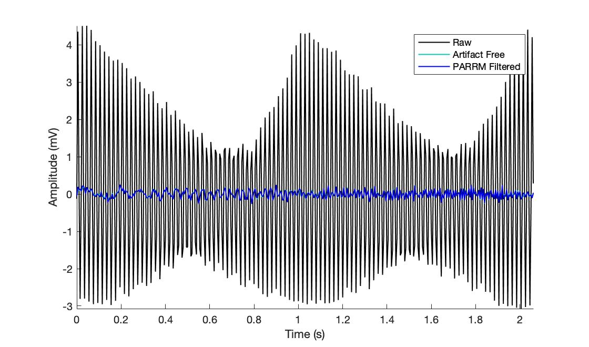
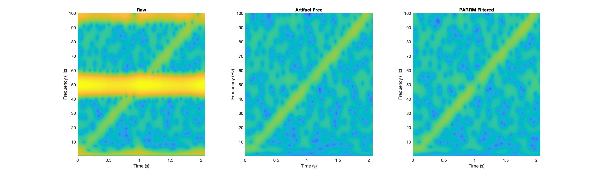

# PARRM

These are all the files we've used over the course of developing the method. I've included them all here in case there's interest but not all of them are necessary for the current incarnation. 

This method operates on the assumption that the artifact is semi-regular, periodic, and linearly combined with the signal of interest.
The first step is finding the period of the artifact in the raw signal. This is done using a grid search centered about the quotient of the sampling rate and stimulation frequency. In order to evaluate each period, samples are translated onto the timescale of the period by finding the modulo of each sample number with the current period of interest. Then, using linear regression, the best fitting sum of sinusoidal harmonics of the period is found and the mean squared error of the fit with the raw data is computed. The period which minimizes this mean squared error is then chosen. This period is used to produce a linear filter that takes four parameters in addition to the period itself: the window size, the skip size, the period distance, and the window direction. Only samples within the window size are used to filter the data at each sample. Samples within the skip size are not used for filtering. Only samples within the period distance on the timescale of the period are averaged together. The window direction is used to specify whether the window only takes past, future, or both into account.

An example of how to use PARRM for a simulated LFP file is included in demo.m and will produce the following figures:

